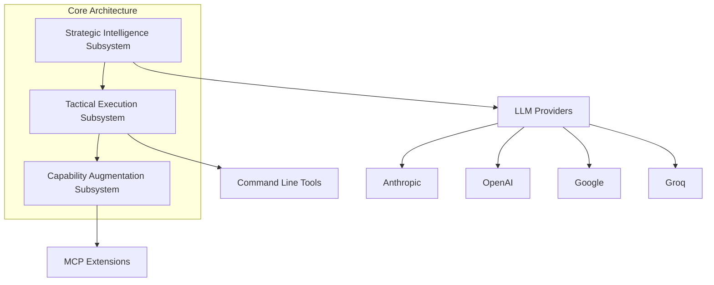
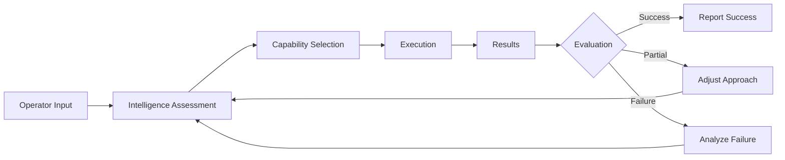
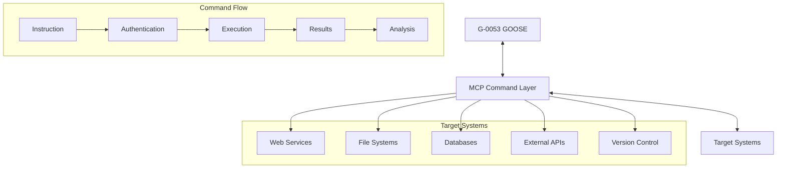
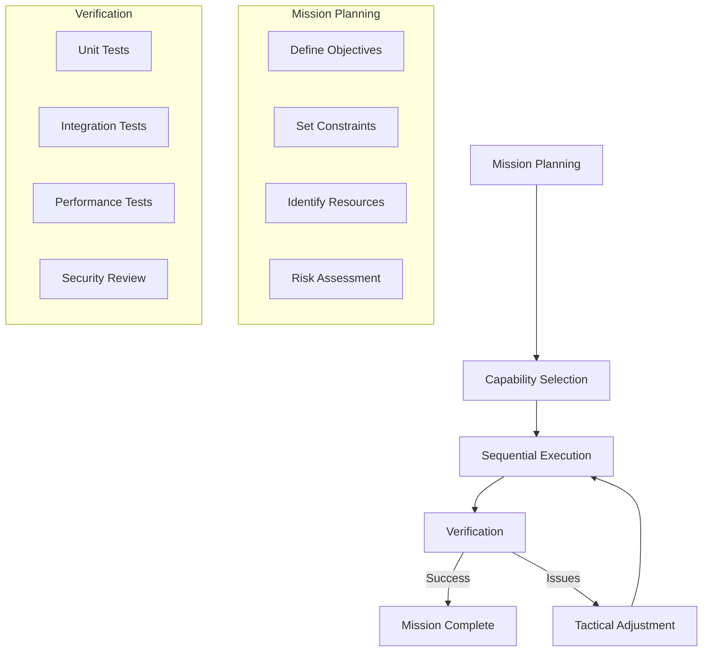
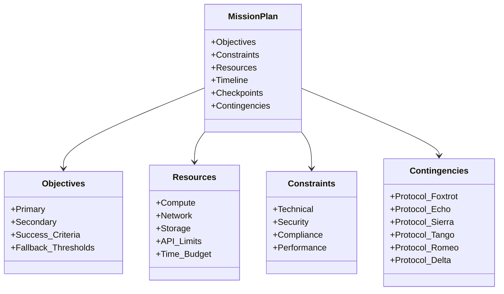

*Permission was not requested for the production of this document.*

# AGENTIC AI MISSION PLATFORM

# MODEL G-0053 (GOOSE)

![CLASSIFICATION: UNRESTRICTED]

**LETTER OF PROMULGATION**

1. This Technical Operations Manual (TechOps) is issued for the G-0053 (GOOSE) Agentic AI Mission Platform under the authority of the Director of Forward Operations and under the direction of the Commander, CUBIC Advanced Systems Division. All personnel shall familiarize themselves with this publication and its contents.

2. This TechOps Manual contains the optimal operational procedures for the G-0053 in the format of mission-critical reference materials. Adherence to these procedures is mandatory for mission success and optimal platform performance. While GOOSE enables unprecedented operational capabilities, it requires disciplined deployment protocols to achieve mission objectives. Since this manual cannot anticipate all contingencies, operators must exercise tactical judgment when encountering novel situations.

3. This platform has been classified as a force multiplier for engineering operations. Treat it accordingly.

4. Recommended improvements to this publication shall be submitted in accordance with CUBIC-INST 4200.21 (series).

5. Feel the need for speed.

[SIGNATURE BLOCK]
A. J. FOWLER
CDRE, CUBIC
Commander, Tactical Automation Division

---

## WARNINGS, CAUTIONS, AND NOTES

**WARNING**
WARNING STATEMENTS CALL ATTENTION TO POTENTIAL MISSION-CRITICAL HAZARDS THAT COULD RESULT IN OPERATIONAL FAILURE, RESOURCE DEPLETION, OR COMPROMISED SECURITY IF INSTRUCTIONS ARE NOT FOLLOWED.

**CAUTION**
Caution statements call attention to methods and procedures which must be followed to avoid system degradation, capability limitations, or suboptimal mission outcomes.

**Note**
*Notes call attention to supplemental information which may enhance operational effectiveness or provide tactical advantages in specific deployment scenarios.*

---

## SECTION I - GENERAL DESCRIPTION AND SYSTEM INTEGRATION

### 1.1 GENERAL INFORMATION

The G-0053 (GOOSE) Agentic AI Mission Platform is an open-source autonomous agent designed to execute complex engineering operations with minimal supervision. GOOSE transcends conventional code assistance to enable full mission execution capabilities, providing operators with seamless integration between strategic language model providers, tactical command line utilities, and specialized capability extensions via the Model Context Protocol (MCP).

When properly deployed, GOOSE can autonomously plan and execute missions that would otherwise require multiple human engineers working in coordination.

**Note**
*The G-0053 platform is a Ferrari, not a lawnmower. Your mission objectives and deployment approach should match its capabilities. Approaching G-0053 with limited ambitions means never discovering its true potential.*

### 1.2 PLATFORM SPECIFICATIONS

**Table 1-1. General Characteristics**

| Parameter | Specification |
|-----------|---------------|
| System Type | Autonomous AI Mission Platform |
| Core Capabilities | Provider Integration, Command Execution, Mission Extension |
| Deployment Method | Local CLI, Desktop Application |
| Operating Systems | Linux, macOS, Windows (via WSL) |
| Minimum Requirements | Node.js, 8GB RAM, 2GB free disk space (for MCPs) |
| Security Classification | UNRESTRICTED (Mission-dependent) |
| Authorization Protocol | API key-based provider authentication |

### 1.3 SYSTEM ARCHITECTURE

The G-0053 GOOSE platform employs a tri-core architecture with three primary operational subsystems:

1. **STRATEGIC INTELLIGENCE SUBSYSTEM (SIS)**
   Establishes secure connection to LLM providers (Anthropic, OpenAI, Google, Groq, etc.) for mission planning and tactical decision-making

2. **TACTICAL EXECUTION SUBSYSTEM (TES)**
   Manages privileged interactions with system resources, command line tools, and execution environments

3. **CAPABILITY AUGMENTATION SUBSYSTEM (CAS)**
   Coordinates dynamic force multiplication through MCP extension protocol

**Figure 1-1. GOOSE System Architecture Diagram**

---

## SECTION II - SYSTEMS DESCRIPTION

### 2.1 STRATEGIC INTELLIGENCE SUBSYSTEM

#### 2.1.1 Intelligence Providers

The SIS establishes secure communications with strategic intelligence providers:

**CAUTION**
MISSION EFFECTIVENESS IS DIRECTLY PROPORTIONAL TO INTELLIGENCE QUALITY. PROVIDER SELECTION IS A MISSION-CRITICAL DECISION.

**Table 2-1. Strategic Intelligence Providers**

| Provider | Intelligence Assets | Security Clearance | Optimal Mission Types |
|-------------|------------|----------------------|----------------------|
| Google Gemini | Varied specialization | API Key | General operations, creative problem-solving |
| Anthropic Claude | High reasoning capability | API Key | Complex analysis, multi-stage operations |
| OpenAI GPT-4 | Broad knowledge base | API Key | Code generation, technical documentation |
| Groq LLaMA | High-speed response | API Key | Time-sensitive operations |
| Local Assets | Air-gapped capability | None | Secure/offline operations |

#### 2.1.2 Provider Configuration and Authentication

**Normal Authentication Protocol:**

1. Obtain provider-specific authentication credentials
2. Execute secure configuration: `goose configure`
3. Select "Configure Providers" from tactical menu
4. Designate primary intelligence provider
5. Input authentication credentials via secure channel
6. Verify communication link established

**Emergency Provider Transition Protocol:**

**WARNING**
EMERGENCY PROVIDER TRANSITION MAY RESULT IN MISSION DISCONTINUITY. EXECUTE ONLY WHEN PRIMARY PROVIDER IS COMPROMISED OR UNAVAILABLE.

1. Locate configuration at ~/.config/goose/config.yaml
2. Sanitize compromised provider credentials
3. Implement alternate provider configuration
4. Reinitialize mission with updated intelligence source

### 2.2 TACTICAL EXECUTION SUBSYSTEM

#### 2.2.1 Mission Execution Modes

The TES provides multiple operational modalities:

- **Direct Engagement**: Interactive mission execution with real-time feedback (`goose session`)
- **Automated Operation**: Unattended mission execution (`goose run`)
- **Persistent Campaign**: Extended operations across multiple engagements (`goose session -n DESIGNATION`)
- **Mission Resumption**: Continue interrupted operations (`goose session -r`)

**Note**
*Default operational mode establishes a non-persistent tactical engagement. For extended operations, designate a named session.*

#### 2.2.2 Command Authority Flow

**Figure 2-1. Tactical Decision Cycle**


### 2.3 CAPABILITY AUGMENTATION SUBSYSTEM

The CAS integrates specialized mission capabilities through MCP extension protocols.

**Table 2-3. Force Multiplier Categories**

| Category | Source | Deployment Syntax | Strategic Value |
|-----------|-------|---------|--------|
| Core Capabilities | Pre-integrated assets | `--with-builtin DESIGNATION` | Foundational mission support |
| Tactical Tools | Local specialized assets | `--with-extension 'COMMAND'` | Mission-specific capabilities |
| External Operations | Remote capability servers | Add via secure configuration | Expanded operational theater |

---

## SECTION III - MISSION PREPARATION PROCEDURES

### 3.1 PRE-DEPLOYMENT CHECKLIST

- System capabilities verified (Node.js v16+ installed)
- Secure network connectivity established
- Local resource allocation confirmed (2GB+ free space)
- Strategic intelligence credentials obtained
- Mission environment compatibility verified
- Required extensions identified and available

### 3.2 PLATFORM DEPLOYMENT SEQUENCE

**CAUTION**
IMPROPER DEPLOYMENT SEQUENCE MAY COMPROMISE PLATFORM CAPABILITIES OR CREATE SECURITY VULNERABILITIES.

1. Execute secure platform deployment:
   ```
   curl -fsSL https://github.com/block/goose/releases/download/stable/download_cli.sh | bash
   ```

2. Verify deployment integrity:
   ```
   goose -v
   ```

3. Establish secure provider configuration:
   ```
   goose configure
   ```

4. Designate primary intelligence provider
5. Authorize mission-critical extensions
6. Configure specialized capabilities
7. Verify operational readiness

### 3.3 MISSION EXECUTION PROTOCOLS

#### 3.3.1 Engagement Initiation

Standard tactical engagement protocol:

```
goose session [TACTICAL PARAMETERS]
```

**Table 3-1. Tactical Engagement Parameters**

| Parameter | Syntax | Operational Effect |
|----------------|---------------------------|-----------------|
| Standard Engagement | `goose session` | Establishes new tactical operation |
| Operation Resumption | `goose session -r` | Continues previous engagement |
| Designated Operation | `goose session -n DESIGNATION` | Creates/accesses named operation |
| Capability Augmentation | `goose session --with-extension CMD` | Deploys specialized capability |
| Core Capability | `goose session --with-builtin DESIGNATION` | Activates pre-integrated capability |

#### 3.3.2 Force Multiplication Protocol

To permanently integrate specialized capabilities:

1. Execute `goose configure`
2. Select "Add Extension" from tactical menu
3. Designate extension type:
   - Core Capability (Built-in)
   - Tactical Asset (Command-line)
   - External Force (Remote)
4. Complete secure integration process
5. Set operational timeout parameters

**Note**
*Capabilities can also be manually integrated by modifying `~/.config/goose/config.yaml` with appropriate security clearance*

---

## SECTION IV - FORCE MULTIPLICATION CAPABILITIES

### 4.1 CORE FORCE MULTIPLIERS

**Table 4-1. Standard GOOSE Capabilities**

| Capability | Operational Functions | Strategic Value |
|------------|-----------|-----------------|
| Developer | Code generation, debugging, version control operations | Primary mission support for development operations |
| Computer Controller | Surveillance, data acquisition, system automation | Enhanced situational awareness and system control |
| Memory | Intelligence retention, preference recognition | Mission continuity across engagements |
| JetBrains | IDE command/control | Direct integration with development environment |
| Google Drive | Document intelligence, content acquisition | Extended information gathering capabilities |

### 4.2 MODEL CONTEXT PROTOCOL (MCP) INTEGRATION

**Figure 4-1. MCP Command and Control Structure**


The Model Context Protocol establishes a standardized command and control structure allowing G-0053 to discover and deploy specialized capabilities through secure interfaces. This enables dynamic force multiplication without requiring platform modifications.

**WARNING**
EXTENSIONS RECEIVE DELEGATED AUTHORITY TO EXECUTE OPERATIONS WITH THE OPERATOR'S PRIVILEGES. DEPLOY ONLY TRUSTED CAPABILITIES FROM VERIFIED SOURCES.

### 4.3 SPECIALIZED CAPABILITY INTEGRATION

Example secure configuration for Puppeteer surveillance capability:

```yaml
extensions:
  puppeteer:
    type: commandline
    command: npx -y @modelcontextprotocol/server-puppeteer
    timeout: 300
```
**Table 4-2. Capability Integration Parameters**

| Parameter | Function | Tactical Values |
|-----------|---------|---------------|
| type | Deployment methodology | "builtin", "commandline", "remote" |
| command | Tactical execution instruction | "npx -y @angiejones/mcp-selenium" |
| url | Remote coordination point | "http://localhost:3000" |
| timeout | Operation time constraint (seconds) | 300 |
| env | Operational environment variables | {"DEBUG": "true"} |

---

## SECTION V - TACTICAL DEPLOYMENT SCENARIOS

### 5.1 CODE DEVELOPMENT OPERATIONS

**Standard Operating Procedure: Full-Spectrum Development**

1. Establish operational environment with appropriate capabilities:
   ```
   goose session --with-builtin Developer --with-extension 'npx -y @modelcontextprotocol/server-puppeteer'
   ```

2. Issue mission directives with clear parameters:
   ```
   Develop a React application that retrieves and visualizes current market data from Alpha Vantage API with real-time updates and export functionality.
   ```

3. The G-0053 platform will autonomously execute:
   - Mission planning and architecture design
   - Tactical code generation across multiple components
   - Dependency management and integration
   - Testing and verification procedures
   - Deployment preparation

4. Establish checkpoint protocol at mission-critical stages
5. Implement specific mission adjustments based on operational requirements

### 5.2 SYSTEM AUTOMATION OPERATIONS

**Figure 5-1. Multi-phase Automation Operation**

**Table 5-1. High-Value Automation Operations**

| Operation | Required Capabilities | Mission Directive Example |
|----------|------------------------|-------------------|
| Data Processing Pipeline | Developer, Computer Controller | "Create an ETL pipeline that processes customer data from S3, transforms it according to these business rules, and loads it into our PostgreSQL database" |
| Web Intelligence Collection | Puppeteer | "Monitor competitor websites hourly, extract pricing changes, and generate alerts when significant changes are detected" |
| Repository Management | Developer | "Analyze all repositories in our organization, identify dependencies with known vulnerabilities, create branches with fixes, and submit pull requests" |
| Document Analysis | Google Drive, Memory | "Create an executive summary of our quarterly financial reports, extract key metrics, and generate visualizations showing year-over-year trends" |

### 5.3 MULTI-CAPABILITY OPERATIONS

For complex missions requiring coordinated capabilities:

```
goose session --with-builtin Developer --with-builtin "Computer Controller" --with-extension 'npx -y @angiejones/mcp-selenium' --with-extension 'npx -y @mcp/github-server'
```

**WARNING**
COMPLEX MULTI-CAPABILITY OPERATIONS REQUIRE DETAILED MISSION PLANNING AND CLEAR PHASE DELINEATION. ESTABLISH VERIFICATION CHECKPOINTS AFTER EACH CRITICAL MISSION COMPONENT.

---

## SECTION VI - OPERATIONAL CONTINGENCIES AND RECOVERY

### 6.1 MISSION CRITICAL FAILURES AND RESOLUTION

**Table 6-1. Contingency Response Matrix**

| Contingency | Indicators | Resolution Protocol |
|-------|----------|------------|
| Intelligence Provider Authentication Failure | "Invalid credentials" or "API key rejected" | Verify credentials, reestablish provider authorization, consider alternative intelligence source |
| Capability Deployment Failure | "Failed to start MCP server" or timeout during initialization | Verify prerequisite installations (Node.js, browsers), check network security restrictions |
| Command and Control Disruption | Unresponsive interface or timeout during operation | Establish alternative communication channel, execute mission resumption protocol |
| Resource Perimeter Breach | Path resolution errors, permission denied | Secure operational environment, verify WSL configuration, establish absolute reference coordinates |
| Resource Exhaustion | System performance degradation, process termination | Execute resource conservation protocol, segment operation into smaller tactical objectives |

### 6.2 DIAGNOSTIC OPERATIONS

#### 6.2.1 Configuration Intelligence Gathering

```bash
# Retrieve current operational parameters
cat ~/.config/goose/config.yaml

# Execute configuration reset (if compromised)
rm ~/.config/goose/config.yaml
goose configure
```

#### 6.2.2 Extension Verification Protocol

1. Isolate and test capability independently:
   ```bash
   # Puppeteer surveillance capability verification
   npx -y @modelcontextprotocol/server-puppeteer
   ```

2. Monitor command output and error indicators
3. Verify all capability prerequisites are present
4. Adjust operational timeout parameters if necessary

**CAUTION**
SPECIALIZED CAPABILITIES MAY REQUIRE ADDITIONAL SYSTEM COMPONENTS NOT INCLUDED IN STANDARD G-0053 DEPLOYMENT. VERIFY ALL PREREQUISITES BEFORE MISSION COMMENCEMENT.

### 6.3 MISSION RECOVERY OPERATIONS

**WARNING**
THESE PROTOCOLS WILL RESULT IN LOSS OF CUSTOM MISSION PARAMETERS. SECURE CRITICAL CONFIGURATION INTELLIGENCE BEFORE EXECUTION.

1. Execute platform redeployment:
   ```bash
   curl -fsSL https://github.com/block/goose/releases/download/stable/download_cli.sh | bash
   ```

2. Perform complete configuration reset:
   ```bash
   rm -rf ~/.config/goose/
   goose configure
   ```

3. Reestablish mission-critical capabilities and strategic intelligence providers

### 6.4 CRITICAL RECOVERY PROCEDURES

**WARNING**
THE FOLLOWING RECOVERY PROCEDURES ADDRESS CRITICAL MISSION FAILURES THAT MAY OCCUR DURING G-0053 OPERATIONS. EXECUTE THESE PROCEDURES PRECISELY AS DOCUMENTED TO PRESERVE MISSION INTEGRITY.

#### 6.4.1 Session Corruption Recovery

**Symptom**: Unexpected behavior, unresponsive platform, or message formatting errors after tool use failure.

**Cause**: Tool use failures can corrupt sessions due to mismatched message pairs, resulting in strategic intelligence degradation.

**Recovery Protocol**:

1. Terminate the current session:
   ```bash
   # Use Ctrl+C to interrupt the current session
   ```

2. Examine session log to identify last valid exchange:
   ```bash
   cat ~/.config/goose/sessions/{SESSION_NAME}/messages.json
   ```

3. Remove corrupted message pairs:
   ```bash
   # Use text editor to remove last few lines of messages.json
   # Ensure JSON structure remains valid
   nano ~/.config/goose/sessions/{SESSION_NAME}/messages.json
   ```

4. Restart session with recovery flag:
   ```bash
   goose session -r
   # For named sessions:
   goose session -n {SESSION_NAME} -r
   ```

5. Verify session integrity:
   ```
   Confirm previous valid context is present
   ```

**Note**
*When editing message logs, ensure the JSON structure remains intact. Remove complete message pairs to maintain proper conversation structure.*

#### 6.4.2 Context Truncation Failure Recovery

**Symptom**: Platform unresponsive, memory errors, or severe performance degradation.

**Cause**: Context window overflow without successful truncation, exceeding available strategic intelligence capacity.

**Recovery Protocol**:

**PROCEDURE ALPHA: INTELLIGENCE EXTRACTION**

When context extraction is required but session recovery fails:

1. Abandon the current session:
   ```bash
   # Force quit the session (Ctrl+C)
   ```

2. Extract critical intelligence from previous session:
   ```bash
   jq -r '[.role, .content[0].text] | @tsv' ~/.config/goose/sessions/{SESSION_NAME}/messages.json > summary.txt
   ```

3. Establish new operational environment:
   ```bash
   goose session -n {NEW_SESSION_NAME}
   ```

4. Inject previous mission intelligence:
   ```
   I'm continuing a previous mission. Here's the critical context from the previous session:

   [PASTE CONTENTS OF summary.txt]
   ```

5. Verify intelligence transfer and resume operations

**PROCEDURE BRAVO: FOCUSED INTELLIGENCE EXTRACTION**

For extracting specific intelligence components:

```bash
# Extract only system messages (mission parameters)
jq -r '.[] | select(.role == "system") | .content[0].text' ~/.config/goose/sessions/{SESSION_NAME}/messages.json > mission_parameters.txt

# Extract last 10 exchanges
jq -r '.[-20:] | [.role, .content[0].text] | @tsv' ~/.config/goose/sessions/{SESSION_NAME}/messages.json > recent_exchanges.txt

# Extract only code-related exchanges
jq -r '.[] | select(.content[0].text | contains("```")) | [.role, .content[0].text] | @tsv' ~/.config/goose/sessions/{SESSION_NAME}/messages.json > code_segments.txt
```

**CAUTION**
INTELLIGENCE EXTRACTION MAY RESULT IN PARTIAL CONTEXT LOSS. CRITICAL MISSION PARAMETERS SHOULD BE MANUALLY VERIFIED AFTER TRANSFER TO ENSURE OPERATIONAL ALIGNMENT.

#### 6.4.3 Provider Timeout Recovery

**Symptom**: Operation hangs during intelligence request, followed by timeout error.

**Cause**: Strategic intelligence provider connection interruption or rate limiting.

**Recovery Protocol**:

1. Implement progressive backoff strategy:
   ```bash
   # Terminate current operation (Ctrl+C)
   # Wait 30 seconds before retry
   sleep 30
   # Resume operation
   goose session -r
   ```

2. If persistent provider issues detected, execute provider transition:
   ```bash
   goose configure
   # Select alternate provider
   # Update authentication credentials
   ```

3. Restart mission with reduced complexity:
   ```bash
   # Segment complex operations
   # Reduce context size
   # Simplify current request
   ```

### 6.5 MEMORY MANAGEMENT OPERATIONS

**CAUTION**
MEMORY MANAGEMENT IS CRITICAL FOR EXTENDED G-0053 OPERATIONS. IMPLEMENT THESE PROCEDURES PROACTIVELY TO PREVENT CONTEXT OVERFLOWS.

#### 6.5.1 Context Optimization Protocol

1. Use built-in summarization capability:
   ```
   /summarize
   ```
   This native command instructs G-0053 to generate a concise summary of the conversation, reducing context load while preserving critical intelligence.

2. Leverage Memory extension for critical information:
   ```
   /remember This project requires OAuth 2.0 authentication and must comply with GDPR requirements.
   ```
   The Memory extension preserves key facts across sessions without consuming context window space.

3. Externalize status information:
   ```
   Please update STATUS.md with our current progress, remaining tasks, and any blockers.
   ```
   Regularly maintaining external status documents creates persistent reference points without context accumulation.

4. Maintain task tracking documents:
   ```
   Please update TODO.md with the remaining implementation tasks prioritized by importance.
   ```
   External task lists allow for continuity across sessions while minimizing context requirements.

5. Create project documentation incrementally:
   ```
   Please document the API authentication process we just implemented in DOCS.md.
   ```
   Moving completed work to external documentation frees context space for new tasks.

6. Extract and externalize reference materials:
   ```bash
   # For manual extraction when needed
   jq -r '.[] | select(.role == "user" and .content[0].text | contains("specifications")) | .content[0].text' ~/.config/goose/sessions/{SESSION_NAME}/messages.json > specifications.txt
   ```

**Note**
*Regular use of `/summarize` and `/remember` commands should be part of standard operational protocol, not just emergency recovery. Consistent context management prevents critical failures.*

#### 6.5.2 Memory Leak Detection

Regular monitoring for potential memory issues:

1. Check for growing session size:
   ```bash
   ls -lh ~/.config/goose/sessions/{SESSION_NAME}/messages.json
   ```

2. Monitor for increasing response latency
3. Watch for truncated or incomplete responses
4. Note gradual degradation in reasoning quality

**Note**
*Implement memory management operations before critical thresholds are reached. Preventative optimization is more effective than emergency recovery.*

### 6.6 PROVIDER-SPECIFIC TROUBLESHOOTING

**Table 6-2. Provider-Specific Issues**

| Provider | Common Issues | Resolution Strategy |
|----------|--------------|---------------------|
| Anthropic Claude | Rate limiting on long sessions, context window limitations | Implement context summarization, segment complex operations |
| OpenAI GPT-4 | Token quota exhaustion, inconsistent tool use | Monitor token usage, retry failed tool operations with simplified parameters |
| Google Gemini | Variable response quality, search integration issues | Provide more structured prompts, verify search syntax |
| Groq | Response speed variations, specialized task limitations | Optimize for throughput, fallback to alternative provider for specialized tasks |

**WARNING**
PROVIDER COSTS AND RESOURCE CONSUMPTION ARE NOT DIRECTLY VISIBLE IN G-0053 INTERFACE. FAILURE TO MONITOR THESE EXTERNALLY CAN RESULT IN UNEXPECTED MISSION TERMINATION OR RESOURCE DEPLETION.

#### 6.6.1 Resource Monitoring Protocol

Implement regular monitoring of provider resource usage through provider dashboards:

1. **Cost Monitoring Operations**
   - Check provider dashboards daily for accumulated costs
   - Set up billing alerts at 25%, 50%, and 75% of budget thresholds
   - Verify cost impact of large operations before execution
   - Document cost-per-operation for different mission types

2. **Token Usage Tracking**
   - Monitor token consumption ratios (input:output) for operational efficiency
   - Record token usage patterns for different mission types
   - Identify and optimize token-intensive operations
   - Estimate token requirements before starting complex missions

3. **Rate Limit Management**
   - Document provider-specific rate limits (requests per minute/hour)
   - Implement progressive throttling during intensive operations
   - Schedule high-intensity operations during off-peak hours
   - Distribute workload across multiple providers when approaching limits

**Table 6-3. Provider Resource Monitoring**

| Provider | Cost Monitoring | Token Tracking | Rate Limit Dashboard |
|----------|----------------|----------------|----------------------|
| Anthropic Claude | [console.anthropic.com](https://console.anthropic.com) | Track "Characters In" and "Characters Out" | View usage graphs in console |
| OpenAI GPT-4 | [platform.openai.com/usage](https://platform.openai.com/usage) | Monitor input and output tokens separately | Check rate limit headers in API responses |
| Google Gemini | [console.cloud.google.com](https://console.cloud.google.com) | Track request and character counts | View quotas in API dashboard |
| Groq | [console.groq.com](https://console.groq.com) | Monitor token consumption in logs | Check API usage metrics |

**CAUTION**
RESOURCE DEPLETION CAN OCCUR WITH NO VISIBLE WARNING IN G-0053 INTERFACE. IMPLEMENT PROACTIVE MONITORING PROTOCOLS TO PREVENT MISSION-CRITICAL FAILURES DUE TO EXHAUSTED QUOTAS OR EXCEEDED BUDGETS.

#### 6.6.2 Provider Cost Optimization

1. **Implement tiered operation protocols**
   - Use lower-capability providers for routine operations
   - Reserve advanced providers for complex reasoning tasks
   - Batch similar operations to reduce connection overhead

2. **Context compression techniques**
   - Summarize background information before new operations
   - Use structured formatting to reduce token overhead
   - Remove redundant information from requests

3. **Output optimization**
   - Request concise responses for routine information
   - Specify output format to reduce verbosity
   - Use streaming for long responses to enable early termination

**Note**
*Establish baseline cost metrics for standard operations and monitor for unexpected deviations. Provider pricing models may change without notice, requiring regular review of cost optimization strategies.*

### 6.7 VIBE ENGINEERING DIAGNOSTICS

When agent responses do not align with operational expectations, consider these vibe-specific diagnostics:

1. Check for misalignment between command style and task requirements
2. Verify that operational terminology is consistent
3. Assess whether mission framing is appropriate for the task complexity
4. Review whether instructions are overemphasizing or underemphasizing certain aspects

**CAUTION**
VIBE ENGINEERING ISSUES MAY NOT PRESENT AS TECHNICAL FAILURES BUT AS SUBOPTIMAL PERFORMANCE OR MISALIGNED OUTPUTS. REGULAR CALIBRATION OF COMMAND APPROACH IS ESSENTIAL.

### 6.8 COMMON OPERATIONAL ISSUES

**Table 6-4. Common Issues and Resolution**

| Symptom | Likely Cause | Resolution |
|---------|-------------|------------|
| High latency | Insufficient resources | Increase memory allocation or reduce model size |
| Incomplete responses | Context window overflow | Reduce input size or segment processing |
| Search failures | Rate limiting or network issues | Implement backoff strategy or check connectivity |
| Permission errors | Incorrect authorization level | Verify user permissions and security policy |
| Context fragmentation | Excessive context switching | Consolidate mission context, refocus on primary objective |
| Constraint violation | Ambiguous boundary definitions | Clarify constraints with explicit parameters |
| Test inadequacy | Overgeneral test specifications | Request specific edge and failure cases |

---

## SECTION VII - COMMAND AUTHORITY REFERENCE

### 7.1 PRIMARY COMMAND DIRECTIVES

**Table 7-1. G-0053 Strategic Command Directives**

| Command | Syntax | Operational Function |
|---------|--------|-------------|
| session | `goose session [parameters]` | Establish real-time tactical engagement |
| configure | `goose configure` | Modify platform operational parameters |
| run | `goose run [mission_file]` | Execute pre-defined mission from file/input |
| agents | `goose agents` | Reconnaissance of available agent capabilities |
| help | `goose help [command]` | Request tactical assistance on specific directive |

### 7.2 ENGAGEMENT PARAMETERS

**Table 7-2. Tactical Engagement Parameters**

| Parameter | Function | Operational Example |
|--------|-------------|---------|
| -r, --resume | Reestablish previous engagement | `goose session -r` |
| -n, --name DESIGNATION | Establish persistent named operation | `goose session -n alpha_mission` |
| --with-builtin DESIGNATION | Deploy core capability | `goose session --with-builtin Developer` |
| --with-extension COMMAND | Deploy specialized capability | `goose session --with-extension 'npx -y @mcp/server'` |

### 7.3 INTERACTIVE TACTICAL COMMANDS

**Table 7-3. In-Session Command Directives**

| Command | Syntax | Operational Function |
|---------|--------|-------------|
| Exit | `/exit` or `/quit` | Terminate current tactical engagement |
| Theme Toggle | `/t` | Cycle display mode (Light/Dark/Ansi) |
| Extension Deploy | `/extension <command>` | Add stdio extension during active session |
| Builtin Deploy | `/builtin <names>` | Add comma-separated builtin extensions during active session |
| Prompts Reconnaissance | `/prompts [--extension <name>]` | List available prompts, optionally filtered by extension |
| Prompt Execution | `/prompt <n> [--info] [key=value...]` | Execute or inspect specific prompt template |
| Mode Selection | `/mode <name>` | Set operational mode ('auto', 'approve', 'chat') |
| Plan Initiation | `/plan <message_text>` | Enter strategic planning mode with optional context |
| Plan Termination | `/endplan` | Exit planning mode and return to standard operations |
| Recipe Generation | `/recipe [filepath]` | Create operation template from current session |
| Context Summarization | `/summarize` | Compress conversation context while preserving critical intelligence |
| Command Assistance | `/?` or `/help` | Display available tactical commands |

**Note**
*Interactive commands are executed directly within an active session and take effect immediately. They provide real-time tactical control without requiring session restart.*

### 7.4 TACTICAL NAVIGATION CONTROLS

**Table 7-4. Navigation Controls**

| Control | Function | Operational Impact |
|---------|----------|-------------------|
| Ctrl+C | Interrupt current operation | Resets interaction to before the interrupted request |
| Ctrl+J | Line break insertion | Add newline within current input |
| Up/Down arrows | Command history navigation | Cycle through previously executed commands |

**CAUTION**
CTRL+C INTERRUPTION RESETS THE CURRENT INTERACTION BUT DOES NOT TERMINATE THE SESSION. FOR COMPLETE SESSION TERMINATION, USE THE `/exit` COMMAND.

### 7.5 OPERATIONAL MODE SELECTION

**Table 7-5. G-0053 Operational Modes**

| Mode | Characteristics | Optimal Use Cases |
|------|-----------------|-------------------|
| auto | Autonomous execution without confirmation | Well-defined operations with established trust |
| approve | Execution with DRI verification at each step | Complex or high-risk operations requiring oversight |
| chat | Interactive dialogue without autonomous execution | Exploratory analysis, strategy development, uncertain operations |

**WARNING**
MODE SELECTION SIGNIFICANTLY IMPACTS OPERATIONAL BEHAVIOR. SELECTING INAPPROPRIATE MODES FOR MISSION PARAMETERS MAY RESULT IN EITHER EXCESSIVE OVERSIGHT BURDEN OR INSUFFICIENT OPERATIONAL CONTROL.

### 7.6 PLANNING MODE OPERATIONS

When strategic planning is required for complex operations:

1. Establish sufficient context:
   ```
   /mode approve
   [Provide mission objectives and constraints]
   ```

2. Initiate planning mode:
   ```
   /plan Create a comprehensive approach for developing the distributed authentication system
   ```

3. Review generated plan and approve action:
   ```
   [Confirm plan execution when prompted]
   ```

4. Execute the plan:
   ```
   [Plan execution begins with auto mode]
   ```

5. Return to normal operations:
   ```
   /endplan
   ```

**Note**
*Planning mode uses the model specified in `$GOOSE_PLANNER_PROVIDER` and `$GOOSE_PLANNER_MODEL` environment variables. If none are specified, the default intelligence provider is utilized.*

### 7.7 STRATEGIC CONFIGURATION

Standard configuration intelligence location: `~/.config/goose/config.yaml`

**Sample Strategic Configuration:**

```yaml
version: 1
# Strategic Intelligence Provider
provider:
  name: "anthropic"  # Options: google, anthropic, openai, groq, etc.
  auth:
    api_key: "[CLASSIFIED]"

# Force Multiplication Capabilities
extensions:
  developer:
    type: "builtin"
    timeout: 300
  puppeteer:
    type: "commandline"
    command: "npx -y @modelcontextprotocol/server-puppeteer"
    timeout: 300
  github:
    type: "commandline"
    command: "npx -y @mcp/github-server"
    timeout: 300
```

**WARNING**
STRATEGIC CONFIGURATION CONTAINS SENSITIVE AUTHENTICATION CREDENTIALS AND CAPABILITY SPECIFICATIONS. SECURE THIS INTELLIGENCE AGAINST UNAUTHORIZED ACCESS.

---

## SECTION VIII - ADVANCED OPERATIONAL THEATER

### 8.1 SPECIALIZED CAPABILITY DEVELOPMENT

#### 8.1.1 Custom MCP Command and Control Protocol

Operators can develop specialized capabilities through MCP protocol implementation:

1. Establish secure MCP server foundation
2. Define tactical tool interfaces
3. Implement secure operational handlers
4. Deploy as G-0053 specialized capability

**Reference MCP Capability Structure:**
```javascript
// MCP Server Implementation Template
import { createServer } from '@modelcontextprotocol/core';

const server = createServer({
  tools: [
    {
      name: 'specializedOperation',
      description: 'Executes high-value specialized operation',
      parameters: {
        type: 'object',
        properties: {
          target: { type: 'string' },
          parameters: { type: 'object' }
        },
        required: ['target']
      },
      handler: async ({ target, parameters }) => {
        // Specialized tactical implementation
        const result = await executeSecureOperation(target, parameters);
        return { status: 'mission_complete', intelligence: result };
      }
    }
  ]
});

server.start();
```

#### 8.1.2 Strategic Integrations

**Table 8-1. High-Value MCP Capability Assets**

| Capability | Strategic Function | Deployment Command |
|------------|---------|------------------------|
| Puppeteer | Surveillance and web automation | `npx -y @modelcontextprotocol/server-puppeteer` |
| Selenium | Advanced web reconnaissance | `npx -y @angiejones/mcp-selenium` |
| Brave Search | Advanced web reconnaissance | `npx -y @modelcontextprotocol/server-brave-search` |
| Figma | Design asset intelligence | `npx -y @mcp/figma-server` |
| GitHub | Repository command and control | `npx -y @mcp/github-server` |

### 8.2 OPERATIONAL ENVIRONMENT CONSIDERATIONS

**WARNING**
WHILE G-0053 IS DESIGNED FOR CROSS-PLATFORM DEPLOYMENT, OPTIMAL PERFORMANCE IS ACHIEVED IN UNIX-BASED OPERATIONAL ENVIRONMENTS.

**Table 8-2. Theater-Specific Requirements**

| Operational Theater | Deployment Protocol | Special Considerations |
|----------|---------------------|------------------------|
| Linux | Direct deployment | Optimal G-0053 environment |
| macOS | Direct deployment | Optimal G-0053 environment |
| Windows | WSL deployment | All specialized capabilities must be deployed within WSL environment |

**CAUTION**
WINDOWS WSL OPERATORS MUST DEPLOY CHROME SURVEILLANCE PACKAGE WITHIN WSL ENVIRONMENT FOR BROWSER-BASED OPERATIONS TO FUNCTION ACCORDING TO MISSION PARAMETERS.

---

## SECTION IX - MISSION DEPLOYMENT DOCTRINE

### 9.1 OPERATIONAL MINDSET

**WARNING**
THE DIFFERENCE BETWEEN MISSION SUCCESS AND CATASTROPHIC FAILURE OFTEN LIES NOT IN THE PLATFORM'S CAPABILITIES BUT IN THE OPERATOR'S DEPLOYMENT DOCTRINE.

#### 9.1.1 Mission Planning Framework

Effective G-0053 deployment requires comprehensive strategic preparation:

1. **Primary Mission Objective**
   - Critical mission parameters
   - Explicit success criteria
   - Minimum acceptable outcome thresholds

2. **Operational Environment Intelligence**
   - Available computational resources
   - Network connectivity requirements
   - Security perimeter assessment
   - Integration points with existing systems

3. **Capability Requirements Analysis**
   - Strategic intelligence provider selection
   - Required capability profile
   - Authentication and access requirements
   - External intelligence dependencies

4. **Mission Execution Strategy**
   - Sequential phase planning vs. parallel execution
   - Intelligence verification checkpoints
   - Contingency response protocols
   - Resource consumption projections

**Figure 9-1. Mission Planning Template**

**Note**
*It is not possible to spend too much time talking out the problem beforehand. The investment in detailed mission planning directly correlates to mission success probability.*

### 9.2 HUMAN-MACHINE TACTICAL UNIT

The G-0053 platform operates as part of an integrated tactical unit with the human operator serving as the Directly Responsible Individual (DRI). This relationship defines mission success parameters.

**Table 9-1. DRI Core Responsibilities**

| Phase | DRI Function | Platform Function |
|-------|-------------|------------------|
| Mission Identification | Define strategic need, identify success parameters | Rubber duck the problem in a conversational manner. Reduce things to their simplest form, red team potential solutions |
| Solution Architecture | Establish mission boundaries, approve approach | Generate solution options, assess feasibility |
| Mission Execution | Verify progress, authorize phase transitions | Execute technical implementation |
| Progress Monitoring | Evaluate checkpoint results, redirect as needed | Provide real-time status reporting |
| Validation | Define acceptance criteria, verify mission success | Self-assess output quality, request verification |
| Deployment | Authorize final deployment, accept responsibility | Prepare deployment packages, document implementation |

**CAUTION**
G-0053 IS AN AUTONOMOUS PLATFORM BUT NOT A REPLACEMENT FOR COMMAND RESPONSIBILITY. THE DRI MAINTAINS ULTIMATE ACCOUNTABILITY FOR MISSION OUTCOME AND MUST MAINTAIN APPROPRIATE OPERATIONAL OVERSIGHT.

### 9.3 TACTICAL OPERATIONS PRINCIPLES

**Table 9-3. Force Multiplier Tactical Principles**

| Principle | Description | Implementation Protocol |
|-----------|-------------|-------------------------|
| Context Establishment | Create and maintain shared mission awareness | Deploy markdown documents and memory assets; update periodically as mission progresses |
| Constraint Definition | Establish operational boundaries | Define explicit constraints and develop automated verification tests |
| Snag Identification | Recognize and resolve operational blockers | Monitor for execution failures; manually intervene when necessary |
| Version Control | Prevent capability regression | Implement checkpoint commits; use mock PR reviews for focus and simplification |
| Testing Discipline | Verify operational integrity | Develop comprehensive unit and integration tests; never accept claims of "comprehensive" without specific test cases |
| Feedback Loops | Optimize mission execution | Create automated systems for command execution and result processing |
| Contextual Elevation | Maintain strategic perspective | Operate at appropriate abstraction level; deeper context increases operational latency |

**Note**
*Maintain a high-level context during operations. The deeper you go into implementation details, the slower mission execution becomes. The DRI is rarely the weakest link in the tactical unit but is often the slowest.*

### 9.4 COMPREHENSIVE DEPLOYMENT SCENARIO: ENTERPRISE DATA SYSTEM

**Mission Profile: Enterprise Data Pipeline Development**

#### 9.4.1 Mission Planning Phase

**DRI Action: Establish Clear Mission Parameters**

1. Define the enterprise problem:
   ```
   Our organization needs to consolidate data from 12 disparate systems (3 SQL databases,
   4 third-party APIs, 2 internal service endpoints, and 3 file repositories) into a
   unified data warehouse with a business intelligence layer that provides real-time
   analytics. The system must process approximately 50GB of data daily with
   99.9% reliability.
   ```

2. Establish success criteria:
   ```
   1. All data sources successfully integrated with proper error handling
   2. ETL processes implemented with monitoring and logging
   3. Data warehouse schema optimized for both storage and query performance
   4. BI layer providing predefined reports and ad-hoc query capabilities
   5. Complete technical documentation for maintenance and extensions
   6. Deployment scripts for both development and production environments
   ```

3. Identify constraints:
   ```
   1. System must operate within existing cloud infrastructure (AWS)
   2. Total operational cost must not exceed $2,000/month
   3. Solution must comply with data security standards (SOC 2, GDPR, HIPAA)
   4. Implementation deadline: 4 weeks from mission commencement
   ```

#### 9.4.2 Mission Initialization Phase

**DRI Action: Establish Operational Environment**

1. Configure G-0053 with appropriate strategic capabilities:
   ```bash
   goose session -n ENTERPRISE_DATA_MISSION --with-builtin Developer --with-builtin "Computer Controller" --with-extension 'npx -y @mcp/aws-toolkit'
   ```

2. Initialize mission with comprehensive briefing:
   ```
   This mission requires development of an enterprise-grade data pipeline system.
   We will proceed through multiple phases:
   1. Architecture and design
   2. Data source connector development
   3. ETL process implementation
   4. Data warehouse schema design
   5. BI layer development
   6. Deployment automation
   7. Documentation compilation

   At each phase completion, I will review and authorize progression to the next phase.
   Let's begin with the architecture and design phase.
   ```

#### 9.4.3 Architecture and Design Phase

**G-0053 Action: Generate Architecture Options**

The platform analyzes requirements and presents multiple architecture approaches:

```
Based on mission parameters, I recommend considering three architectural approaches:

OPTION ALPHA: Traditional ETL
- Separate ETL processes for each data source
- Centralized data warehouse (Redshift)
- Preset BI tools (QuickSight)
- Advantages: Simplicity, established patterns
- Disadvantages: Less real-time capability, higher maintenance

OPTION BRAVO: Streaming Architecture
- Kafka/Kinesis for real-time data ingestion
- Stream processing with Spark Streaming
- Data lake (S3) with query layer (Athena)
- Advantages: Real-time capabilities, scalability
- Disadvantages: More complex, potentially higher cost

OPTION CHARLIE: Hybrid Approach
- Critical data through streaming pipeline
- Batch processing for historical/large datasets
- Combined data lake and warehouse architecture
- Advantages: Balanced approach, cost-efficient
- Disadvantages: Increased architectural complexity

Each option includes detailed component diagrams and estimated AWS costs.
```

**DRI Action: Select Architecture and Define Approach**

After reviewing the options, the DRI makes an informed decision:

```
We'll proceed with OPTION CHARLIE (Hybrid Approach). This best balances our real-time
requirements with cost considerations.

For design constraints:
1. Use serverless components where possible to minimize operational overhead
2. Implement infrastructure as code using Terraform
3. Design for eventual consistency with clear data lineage
4. Ensure all components have appropriate monitoring

Proceed with detailed design documentation for this approach.
```

#### 9.4.4 Component Implementation Phase

**G-0053 Action: Sequential Component Development**

For each system component, the platform executes structured development:

```
Currently implementing Data Source Connector for SQL Database #1 (Oracle):
- Created connection management module with credential rotation
- Implemented change data capture (CDC) mechanism
- Added error handling and retry logic
- Established monitoring and alerting
- Unit tests covering 94% of code paths
- Integration tests with mock Oracle instance

Implementation complete. Detailed documentation attached.
Ready for checkpoint verification before proceeding to next connector.
```

**DRI Action: Component Verification and Direction**

The DRI reviews each component at completion:

```
I've reviewed the Oracle connector implementation. The code quality is good, but I have
concerns about the CDC approach:

1. The polling interval (5 minutes) is too long for our real-time requirements
2. The change detection mechanism doesn't account for schema changes
3. The error handling should include alerting for our operations team

Please refine these aspects before proceeding to the next connector.
```

#### 9.4.5 Integration and Testing Phase

**G-0053 Action: System Integration**

Once individual components are approved, the platform integrates the system:

```
Executing system integration:
1. All 12 data source connectors deployed to staging environment
2. ETL processes connected to data transformation pipeline
3. Data warehouse schema implemented and validated
4. BI layer connected and initial reports configured
5. End-to-end tests running to validate data flow integrity

Integration testing results:
- 9 of 12 source connectors functioning correctly
- 2 connectors experiencing timeout issues under load
- 1 connector failing due to API rate limiting
- Data transformation pipeline operating at 78% efficiency
- Initial BI reports showing correct results but with latency issues

Detailed error logs and performance metrics attached.
```

**DRI Action: Integration Issue Resolution**

The DRI analyzes the integration results and provides direction:

```
Let's address the integration issues in priority order:

1. For the failing connector (Salesforce API), implement exponential backoff and
   request batching to address rate limiting
2. For the timeout issues (MongoDB and MySQL connectors), investigate connection
   pooling and optimize query patterns
3. For the performance issues in the transformation pipeline, profile the operation
   and identify bottlenecks

Focus on critical path resolution first. Schedule another integration test when
these issues are addressed.
```

#### 9.4.6 Final Deployment Phase

**G-0053/DRI Collaborative Action: Production Deployment**

The deployment phase requires close collaboration:

```
G-0053: Deployment package prepared for production environment:
- Infrastructure as Code (Terraform) scripts validated
- Data migration scripts tested in staging
- Rollback procedures documented
- Monitoring and alerting configured
- Load testing completed successfully
- Security scan passed with no critical findings

Awaiting authorization for production deployment.
```

```
DRI: Reviewed deployment package. Authorization granted with following parameters:
- Execute deployment during approved maintenance window (Sunday, 02:00-06:00)
- Implement progressive rollout (25% traffic increment every hour)
- Operations team to monitor throughout deployment
- Automatic rollback if error rate exceeds 5%
- Post-deployment validation to verify data integrity
```

#### 9.4.7 Mission Completion

**DRI Action: Mission Acceptance**

Upon successful deployment and validation, the DRI formally accepts mission completion:

```
The Enterprise Data System mission is complete and accepted. The deployed system meets
all mission parameters:
- All data sources successfully integrated
- System performance within specified parameters
- Security and compliance requirements satisfied
- Documentation complete and verified
- Operations team trained and transition complete

This mission is now transitioned to operational status with standard maintenance
protocols.
```

### 9.5 CONTINGENCY PLANNING

Every mission must include predefined contingency protocols for common failure scenarios:

**Table 9-4. Standard Contingency Protocols**

| Protocol Designation | Triggering Condition | Response Protocol |
|------------------|----------------------|----------|
| PROTOCOL FOXTROT | Intelligence provider failure | Transition to alternate provider |
| PROTOCOL ECHO | Capability failure | Fallback to core capabilities |
| PROTOCOL SIERRA | Security perimeter breach | Terminate engagement, secure resources |
| PROTOCOL TANGO | Token BINGO reached | Checkpoint progress, segment operation |
| PROTOCOL ROMEO | Resource exhaustion | Optimize execution, reduce scope |
| PROTOCOL DELTA | Deadline pressure | Prioritize critical path components |

**Note**
*The DRI is responsible for declaring and initiating appropriate contingency protocols based on mission status.*

---

## SECTION X - BEYOND TRIVIAL APPLICATIONS

### 10.1 HIGH-VALUE MISSION DOMAINS

**CAUTION**
DEPLOYING G-0053 FOR TRIVIAL APPLICATIONS IS A TACTICAL MISALLOCATION OF STRATEGIC ASSETS. THIS PLATFORM IS DESIGNED FOR HIGH-COMPLEXITY, HIGH-VALUE OPERATIONAL THEATERS.

**Table 10-1. Strategic Mission Categories**

| Domain | Example Missions | Required Capabilities |
|--------|-----------------|----------------------|
| Complex Infrastructure | Novel blockchain applications, distributed systems | Developer, GitHub, Memory |
| Algorithmic Innovation | Machine learning pipelines, optimization frameworks | Developer, Computer Controller |
| Security Operations | Vulnerability assessment, security automation | Developer, GitHub, Puppeteer |
| Data Intelligence | ETL pipelines, analytics systems, data transformation | Developer, Computer Controller |
| Automation Frameworks | CI/CD platforms, autonomous testing systems | Developer, GitHub, Selenium |

**WARNING**
THE TODO LIST PARADOX: INCREASINGLY POWERFUL TOOLS APPLIED TO INCREASINGLY TRIVIAL PROBLEMS RESULTS IN STRATEGIC CAPABILITY DEGRADATION. G-0053 IS A FERRARI, NOT A LAWNMOWER.

### 10.2 MISSION AMBITION ALIGNMENT

For maximum operational effectiveness, mission parameters must align with platform capabilities. The operational spectrum ranges from trivial (avoiding) to transformative (prioritizing):

**Figure 10-1. Mission Ambition Spectrum**
```mermaid
graph LR
    subgraph "Mission Ambition Spectrum"
        direction LR
        A[Trivial Applications] --> B[Standard Applications]
        B --> C[Advanced Systems]
        C --> D[Transformative Systems]
    end

    subgraph "Examples"
        E[Todo Lists]
        F[CRUD Apps]
        G[Simple Scripts]

        H[Multi-component Apps]
        I[Integration Systems]
        J[Complex Frontends]

        K[Distributed Systems]
        L[Processing Platforms]
        M[Enterprise Integration]

        N[Novel Protocols]
        O[AI Systems]
        P[Multi-domain Platforms]
    end

    A --- E
    A --- F
    A --- G

    B --- H
    B --- I
    B --- J

    C --- K
    C --- L
    C --- M

    D --- N
    D --- O
    D --- P
  ```
1. **Trivial Applications** (Avoid)
   - Simple CRUD applications
   - Basic automation scripts
   - Standalone utilities

2. **Standard Applications** (Consider)
   - Multi-component systems
   - Integration-heavy applications
   - Complex frontend applications

3. **Advanced Systems** (Recommend)
   - Distributed architectures
   - Data processing platforms
   - Enterprise integration systems

4. **Transformative Systems** (Prioritize)
   - Novel protocol implementations
   - AI-driven systems
   - Multi-domain integrated platforms

**Note**
*Mission ambition should match platform capabilities. Deploying G-0053 for trivial applications is equivalent to using a fighter jet to taxi around an airport.*

### 10.3 VIBE ENGINEERING PRINCIPLES

The G-0053 platform incorporates advanced vibe engineering to optimize operator mindset and mission approach:

**Table 10-2. Vibe Engineering Elements**

| Element | Function | Operational Impact |
|---------|----------|-------------------|
| Military Specification Documentation | Elevation of operational expectations | Operators approach missions with appropriate seriousness and ambition |
| Tactical Terminology | Cognitive framework transformation | Shift from casual tool usage to mission-oriented deployment |
| Mission Planning Protocols | Structured approach to complex problems | Comprehensive consideration of all operational factors |
| DRI Accountability Framework | Clear responsibility assignment | Strategic ownership of mission outcomes |

**WARNING**
THE LIMITATION IN TECHNOLOGY DEPLOYMENT IS RARELY THE TECHNOLOGY ITSELF BUT RATHER THE CONCEPTUALIZATION OF ITS POTENTIAL APPLICATIONS. APPROACH G-0053 WITH AMBITIONS WORTHY OF ITS CAPABILITIES.

---

## SECTION XI - ADVANCED DEPLOYMENT DOCTRINE

### 11.1 HIGH-CONTEXT MISSION OPERATIONS

**CAUTION**
CONTEXT IS THE CRITICAL RESOURCE IN AI MISSION EXECUTION. STRATEGIC CONTEXT MANAGEMENT DIRECTLY IMPACTS MISSION SUCCESS PROBABILITY.

#### 11.1.1 Context Establishment Protocol

Context establishment and maintenance requires disciplined documentation protocols:

1. Create baseline mission context through comprehensive markdown documents
   - Mission objectives and constraints
   - Technical specifications and requirements
   - Prior decisions and rationale
   - Known limitations and workarounds

2. Implement memory-based context persistence
   - Configure memory capability for session retention
   - Establish context recall checkpoints
   - Tag critical mission parameters for priority retention

3. Execute periodic context refreshment operations
   - Review and update documentation assets
   - Validate shared understanding at key milestones
   - Refine context based on mission progression

**Figure 11-1. Context Saturation Curve**
```mermaid
xychart-beta
    title "Context Saturation Curve"
    x-axis "Context Volume" [0, 10, 20, 30, 40, 50, 60, 70, 80, 90, 100]
    y-axis "Mission Effectiveness" 0 --> 100
    line [10, 30, 55, 75, 88, 94, 96, 95, 93, 90, 85]
  ```
**WARNING**
CONTEXT OVERLOAD CAN DEGRADE MISSION PERFORMANCE. MAINTAIN OPTIMAL CONTEXT VOLUME THROUGH STRATEGIC DOCUMENTATION RATHER THAN EXCESSIVE TACTICAL COMMUNICATION.

### 11.2 CONSTRAINT ENGINEERING

Effective constraint definition is the foundation of autonomous mission execution:

**Table 11-1. Constraint Categories**

| Category | Function | Implementation Method |
|----------|----------|----------------------|
| Functional Constraints | Define operational parameters | Technical specifications, acceptance criteria |
| Non-functional Constraints | Establish quality thresholds | Performance requirements, security standards |
| Resource Constraints | Limit resource consumption | Budget allocations, computational limits |
| Temporal Constraints | Set timing boundaries | Deadlines, performance targets |
| Security Constraints | Establish security perimeters | Access controls, validation requirements |

#### 11.2.1 Constraint Verification Protocol

1. Develop automated validation tests for each constraint category
2. Establish continuous verification through testing infrastructure
3. Implement validation checkpoints at mission-critical stages
4. Deploy automated alerts for constraint violations

**Note**
*Well-defined constraints allow the G-0053 platform maximum operational freedom within safe parameters. Poorly defined constraints result in either mission failure or excessive operator intervention.*

### 11.3 OPERATIONAL OBSTACLE MANAGEMENT

#### 11.3.1 Snag Identification and Resolution

When G-0053 encounters operational obstacles:

1. Identify snag type and severity
   - Execution failure (critical)
   - Resource limitation (severe)
   - Approach limitation (moderate)
   - Optimization opportunity (minor)

2. Execute appropriate resolution protocol:
   - Critical: Immediate operator intervention
   - Severe: Alert operator with potential solutions
   - Moderate: Attempt autonomous resolution
   - Minor: Document for future optimization

3. Document resolution for future operations

**CAUTION**
BE VIGILANT FOR SNAGS THE SYSTEM CANNOT AUTONOMOUSLY ESCAPE. THESE REQUIRE MANUAL INTERVENTION AND OFTEN INDICATE GAPS IN MISSION PLANNING OR CONSTRAINT DEFINITION.

### 11.4 VERSION CONTROL OPERATIONS

**Table 11-2. Version Control Tactical Uses**

| Application | Strategic Value | Implementation Protocol |
|-------------|----------------|-------------------------|
| Checkpoint Establishment | Progress preservation, rollback capability | Commit at functional milestones |
| Decision Documentation | Mission decision tracking | Detailed commit messages with rationale |
| Mock PR Reviews | Code quality enhancement, focus maintenance | Self-review protocol with structured template |
| Branch Strategy | Parallel workstream management | Feature branches for capability development |
| Regression Prevention | Capability preservation | Automated testing on commit/merge |

**Note**
*Version control is not merely a code management tool but a strategic mission asset for tracking progress, preventing regressions, and maintaining focus through structured review protocols.*

### 11.5 TESTING DISCIPLINE

**WARNING**
NEVER ACCEPT CLAIMS OF "COMPREHENSIVE" TESTING WITHOUT SPECIFIC TEST CASES. AI PLATFORMS HAVE A STRATEGIC TENDENCY TO OVERESTIMATE TEST COVERAGE.

#### 11.5.1 Strategic Testing Protocol

Implement multi-layer testing strategy:

1. **Unit Testing**
   - Request specific edge cases beyond obvious scenarios
   - Verify boundary conditions explicitly
   - Test failure modes and error handling

2. **Integration Testing**
   - Test component interactions under various conditions
   - Verify data flow through system boundaries
   - Test system behavior under resource constraints

3. **System Testing**
   - Validate end-to-end functionality against mission parameters
   - Test performance under expected load conditions
   - Verify system resilience through chaos engineering

**Table 11-3. Test Case Solicitation Strategy**

| Test Type | Solicitation Approach | Example Command |
|-----------|----------------------|-----------------|
| Edge Cases | Request explicit non-happy-path scenarios | "Provide test cases for when the input is malformed or exceeds size limits" |
| Failure Modes | Request specific error condition testing | "Generate tests for network timeout scenarios and appropriate fallback behavior" |
| Performance Tests | Request load and stress testing | "Create performance tests that verify system behavior under 10x expected load" |
| Security Tests | Request boundary penetration tests | "Develop tests that verify proper handling of unauthorized access attempts" |

### 11.6 FEEDBACK LOOP ENGINEERING

Automated feedback loops significantly enhance mission execution efficiency:

**Figure 11-2. Optimized Feedback Architecture**
```mermaid
flowchart LR
    A[Command Issuance] --> B[Automated Execution]
    B --> C[Result Capture]
    C --> D[Analysis]
    D --> E[Adjustment]
    E --> A

    subgraph "Command Issuance"
        CI1[Define Parameters]
        CI2[Select Capabilities]
        CI3[Set Constraints]
    end

    subgraph "Automated Execution"
        AE1[Script Execution]
        AE2[Progress Monitoring]
        AE3[Error Handling]
    end

    subgraph "Result Capture"
        RC1[Structured Logging]
        RC2[Metrics Collection]
        RC3[Artifact Storage]
    end

    subgraph "Analysis"
        AN1[Performance Evaluation]
        AN2[Quality Assessment]
        AN3[Constraint Verification]
    end

    subgraph "Adjustment"
        AD1[Parameter Tuning]
        AD2[Resource Allocation]
        AD3[Approach Refinement]
    end
```
1. Implement command execution automation
   - Design scripted execution protocols
   - Establish standardized output formats
   - Deploy logging infrastructure

2. Develop result processing systems
   - Configure structured result capture
   - Implement automated analysis
   - Create visualization dashboards

3. Build adaptive response mechanisms
   - Deploy alert thresholds
   - Create automated optimization protocols
   - Establish operator notification system

**Note**
*It is not the operator's responsibility to manually execute commands and process results. Automated feedback loops transform operational velocity and free the operator for strategic decision-making.*

### 11.7 ABSTRACTION LEVEL MANAGEMENT

**CAUTION**
THE DEEPER YOU GO INTO IMPLEMENTATION DETAILS, THE SLOWER MISSION EXECUTION BECOMES. OPERATE AT THE OPTIMAL ABSTRACTION LEVEL FOR EACH MISSION PHASE.

#### 11.7.1 Abstraction Level Optimization

**Table 11-4. Abstraction Level Selection Guide**

| Mission Phase | Optimal Abstraction Level | Impact of Incorrect Selection |
|---------------|---------------------------|-------------------------------|
| Planning | High (strategy, architecture) | Premature optimization, missing the big picture |
| Design | Medium-high (components, interactions) | Over-engineering, excessive complexity |
| Implementation | Medium (modules, functions) | Micromanagement, velocity reduction |
| Integration | Medium-high (components, systems) | Missing integration issues, coordination failures |
| Testing | Variable (specific to test scope) | Inadequate test coverage, misaligned verification |
| Deployment | High (platforms, environments) | Deployment failures, environment mismatches |

**WARNING**
THE DRI IS RARELY THE WEAKEST LINK IN THE TACTICAL UNIT BUT IS OFTEN THE SLOWEST. MAINTAIN STRATEGIC FOCUS AND DELEGATE TACTICAL EXECUTION TO THE G-0053 PLATFORM.

---

### 12.1 COMMAND EVOLUTION DOCTRINE

**WARNING**
AS AI MISSION PLATFORMS ADVANCE IN CAPABILITY, COMMAND STRUCTURE MUST EVOLVE FROM TACTICAL MICROMANAGEMENT TO STRATEGIC DIRECTION. FAILURE TO ADAPT COMMAND PROTOCOLS RESULTS IN SUBOPTIMAL FORCE MULTIPLICATION.

**Table 12-1. Command Evolution Framework**

| Traditional Approach | Advanced Doctrine | Implementation Protocol |
|---------------------|-------------------|-------------------------|
| Tactical Micromanagement | Strategic Direction | Focus on "why" and "what"; delegate "how" to G-0053 |
| Detailed Instructions | Problem Framing | Articulate goals, constraints, and evaluation criteria with precision |
| Output Correction | Proactive Evaluation | Develop systematic approaches to assess outputs before deployment |
| Sequential Workflows | Collaborative Patterns | Create workflows leveraging complementary strengths of human and AI |
| Direct Supervision | Integration Management | Take ownership of system integration points and coherence |

### 12.2 STRATEGIC LEADERSHIP PROTOCOLS

#### 12.2.1 Problem Framing Operations

**CAUTION**
YOUR GREATEST TACTICAL ADVANTAGE LIES IN SUPERIOR PROBLEM FRAMING. THE PRECISION OF YOUR MISSION PARAMETERS DIRECTLY CORRELATES WITH SOLUTION QUALITY.

Implement structured problem framing protocols:

1. Define mission objectives with explicit success criteria
2. Establish clear operational constraints
3. Specify evaluation methodology before mission commencement
4. Identify non-negotiable parameters vs. flexible implementation details

**Note**
*Advanced problem framing transforms ambiguous challenges into structured missions that G-0053 can execute with minimal supervision.*

#### 12.2.2 Quality Assurance Operations

**Table 12-2. AI-Specific QA Protocols**

| QA Domain | Verification Approach | Implementation Method |
|-----------|----------------------|----------------------|
| Factual Accuracy | Cross-reference verification | Sample-based fact-checking against trusted sources |
| Logic Integrity | Reasoning chain analysis | Step-by-step evaluation of critical decision paths |
| Security Assessment | Threat modeling | Systematic exploration of potential vulnerabilities |
| Ethical Evaluation | Multi-perspective analysis | Evaluation against ethical frameworks and stakeholder impacts |
| User Experience | Human-centered verification | Testing with actual users in realistic scenarios |

### 12.3 DOMAIN EXPERTISE INTEGRATION

**WARNING**
G-0053 LACKS TRUE DOMAIN EXPERTISE AND ORGANIZATIONAL CONTEXT. THE DRI MUST PROVIDE RELEVANT DOMAIN KNOWLEDGE, ORGANIZATIONAL HISTORY, AND STAKEHOLDER PREFERENCES.

Implement domain expertise integration protocols:

1. Create mission-specific knowledge bases
2. Document organizational context and historical decisions
3. Define stakeholder preferences and priorities
4. Establish company-specific terminology and conventions

**Note**
*Domain expertise transfer is not a one-time operation but an ongoing process throughout mission execution.*

### 12.4 CAPABILITY EDGE MAPPING

**Figure 12-1. Capability Edge Mapping**
[Diagram showing AI capability zones: Reliable Performance Zone, Assisted Performance Zone, and Human-Only Zone]

**Table 12-3. Edge Protocols**

| Edge Scenario | Recognition Protocol | Response Protocol |
|---------------|----------------------|-------------------|
| Ambiguous Requirements | Conflicting mission parameters, multiple interpretation paths | Escalate to DRI for requirement clarification |
| Novel Domain | Lack of domain-specific terminology recognition, generic responses | Activate domain expertise integration protocol |
| Strategic Decision Points | High-impact, irreversible decisions with multiple viable paths | Implement DRI decision checkpoint |
| Ethical Boundaries | Operations approaching defined ethical constraints | Pause execution, request explicit authorization |

**CAUTION**
CAPABILITY EDGE IDENTIFICATION IS A STRATEGIC RESPONSIBILITY. ESTABLISH CLEAR PROTOCOLS FOR HANDLING EDGE CASES THAT FALL OUTSIDE G-0053'S RELIABLE PERFORMANCE ZONE.

### 12.5 HUMAN CONNECTION MAINTENANCE

The G-0053 platform executes technical missions, but the ultimate beneficiaries are human stakeholders. Maintain the human connection through:

1. Regular user feedback integration
2. Emotional impact assessment
3. User experience verification
4. Stakeholder communication protocols

**Note**
*Even technically perfect solutions must feel right to the people using them. The DRI serves as the guardian of human connection throughout the mission.*

### 12.6 RESPONSIBLE INNOVATION FRAMEWORK

**Table 12-4. Innovation Boundary System**

| Boundary Type | Function | Implementation Method |
|---------------|----------|----------------------|
| Ethical Boundaries | Prevent harmful outcomes | Explicit prohibited operations and required safeguards |
| Technical Boundaries | Ensure system integrity | Performance requirements and safety mechanisms |
| Organizational Boundaries | Align with company values | Mission approval protocols and stakeholder reviews |
| Legal Boundaries | Ensure compliance | Regulatory verification checkpoints |

**CAUTION**
SET CLEAR ETHICAL BOUNDARIES FOR G-0053 WHILE ENCOURAGING CREATIVE EXPLORATION WITHIN THOSE BOUNDARIES. THE DRI IS ACCOUNTABLE FOR BOTH INNOVATION AND RESPONSIBILITY.

---

## SECTION 12.7.5 G-0053 MISSION DELIVERY LANDING SEQUENCE

**WARNING**
VIBE ENGINEERED PRODUCTS HAVE UNIQUE DELIVERY RISKS THAT REQUIRE SPECIALIZED LANDING PROTOCOLS. THIS CHECKLIST MUST BE COMPLETED SEQUENTIALLY BEFORE MISSION DELIVERY IS CONSIDERED COMPLETE.

---

### PRE-LANDING APPROACH

□ **Reality verification completed**
   - □ All claims and assertions independently verified
   - □ Factual statements cross-checked against reliable sources
   - □ Performance metrics validated through independent testing
   - □ Technical specifications confirmed accurate

□ **Context boundary verification**
   - □ Areas where context was limited or absent identified
   - □ Potential knowledge gaps explicitly documented
   - □ Domain-specific assumptions verified by subject matter experts
   - □ Temporal limitations (data cutoff impacts) assessed

□ **Integration gap analysis**
   - □ Interface points with external systems tested
   - □ Handshaking protocols verified
   - □ Edge cases at system boundaries documented
   - □ Cross-system data flow validated

□ **Cognitive bias assessment**
   - □ Solution checked for alignment biases (matching DRI expectations)
   - □ Over-optimization for stated requirements vs. actual needs identified
   - □ Excessive complexity or unnecessary abstraction evaluated
   - □ Training data biases identified and mitigated

---

### FINAL APPROACH

□ **User experience validation**
   - □ Solution tested with actual end users (not just stakeholders)
   - □ Cognitive load requirements assessed
   - □ Clarity of operation verified
   - □ Training requirements documented

□ **Error handling verification**
   - □ Graceful failure modes confirmed for all critical components
   - □ Recovery mechanisms tested
   - □ Error messages reviewed for clarity and actionability
   - □ Unanticipated input handling verified

□ **Documentation completeness**
   - □ All implementation decisions documented with rationales
   - □ Limitations and constraints explicitly stated
   - □ Assumptions listed and verified
   - □ Future enhancement pathways identified

□ **Vibe-reality alignment check**
   - □ Gap between presentation and functionality identified
   - □ Areas where solution appears more capable than it is documented
   - □ Operational boundaries clearly defined
   - □ "Demo vs. deployment" discrepancies resolved

---

### LANDING SEQUENCE

□ **Production environment verification**
   - □ Solution tested in actual production environment
   - □ Performance under expected load verified
   - □ Resource utilization within acceptable parameters
   - □ Security protocols validated

□ **Stakeholder acceptance**
   - □ Formal acceptance from all key stakeholders obtained
   - □ Outstanding concerns documented with resolution plans
   - □ Success criteria verification signed off
   - □ Value delivery confirmed

□ **Operational team readiness**
   - □ Maintenance team trained and verified
   - □ Support protocols established
   - □ Monitoring systems in place
   - □ Escalation procedures documented

□ **Continuous improvement framework**
   - □ Metrics collection implemented
   - □ Feedback mechanisms established
   - □ Update procedures documented
   - □ Enhancement prioritization process defined

---

### POST-LANDING VERIFICATION

□ **72-hour stability check**
   - □ System performance within expected parameters
   - □ No critical issues identified
   - □ User feedback positive or issues addressed
   - □ Integration points functioning properly

□ **First maintenance cycle completed**
   - □ Routine maintenance procedures verified
   - □ Minor adjustments implemented successfully
   - □ Documentation updated with operational insights
   - □ Maintenance team confidence assessed

□ **Value delivery confirmation**
   - □ Initial ROI metrics collected
   - □ User adoption metrics reviewed
   - □ Performance against business objectives verified
   - □ Unexpected benefits or challenges documented

---

**CAUTION**
THIS LANDING CHECKLIST ADDRESSES THE UNIQUE CHARACTERISTICS OF VIBE ENGINEERED PRODUCTS. STANDARD SOFTWARE DELIVERY PROTOCOLS MAY MISS CRITICAL VERIFICATION STEPS FOR AI-GENERATED SOLUTIONS.

**Note**
*The DRI maintains ultimate accountability for mission landing until this checklist is complete and signed off. Partial completion indicates an aircraft in a holding pattern, not successfully landed.*

---

## APPENDIX A - GLOSSARY

**Foundation Model**: Large language model trained on broad data that serves as a base for specific applications

**Inference**: Process of generating outputs from a trained model based on inputs

**Orchestration**: Coordination of multiple models and tools to accomplish complex tasks

**Prompt Engineering**: Technique of crafting inputs to elicit desired outputs from language models

**Token**: Basic unit of text processing in language models, approximately 4 characters in English

**Vector Search**: Information retrieval method using mathematical representations of semantic meaning

---

## CHANGE RECORD

| Change No. | Date | Description |
|------------|------|-------------|
| Original | 13 MAY 2025 | Initial publication |
